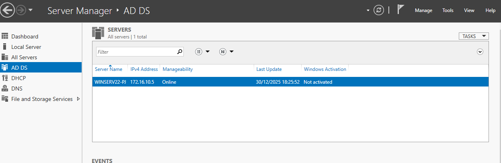
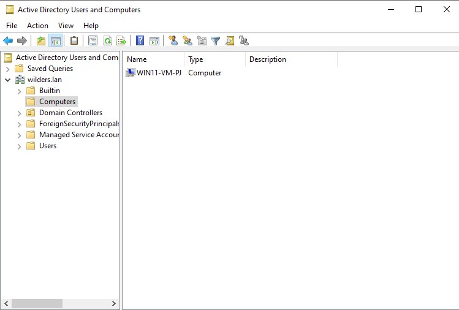
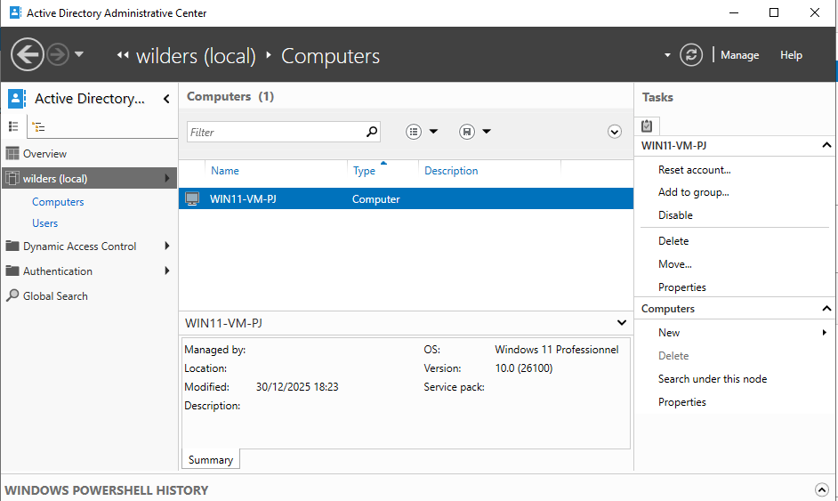
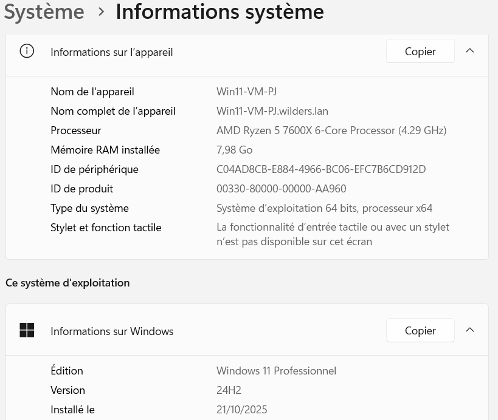

# Active-Directory-Domain-Services
  
### La fenêtre du Server Manager où on voit clairement que le rôle AD DS est installé  

  

### La fenêtre de la console Active Directory Users and Computers

### Une autre fenêtre dans Administrative center

### Le client

