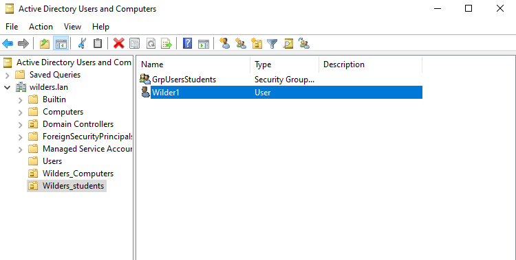
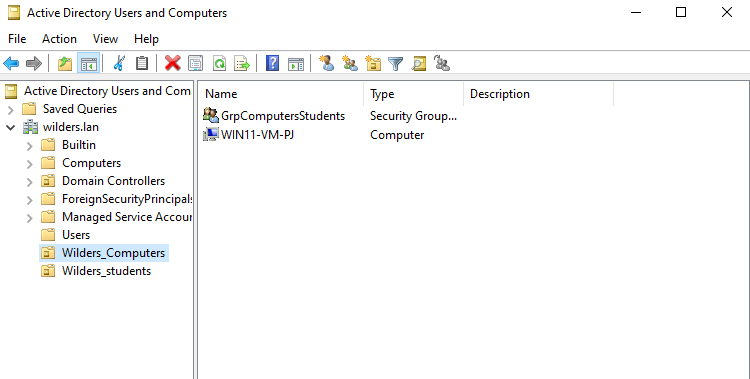
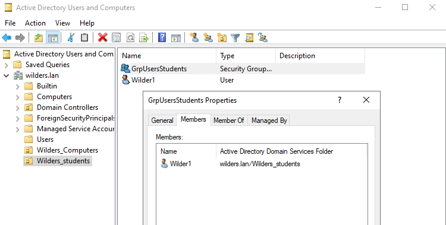
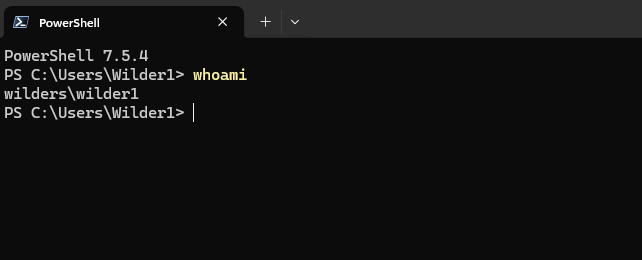

# Organizational Unit (OU)

### L'OU utilisateurs où on voit le compte utilisateur

### L'OU ordinateur où on voit le client

### La fenêtre du groupe utilisateur dans laquelle on voit l'utilisateur membre

### La fenêtre du groupe ordinateur dans laquelle on voit le client membre

### Sur le client, le résultat de la commande whoami

