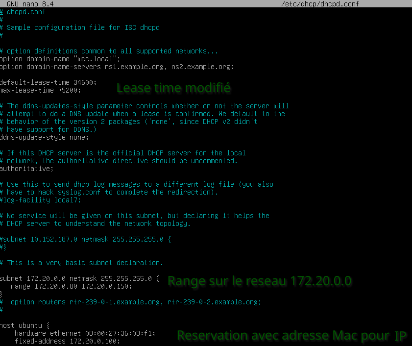
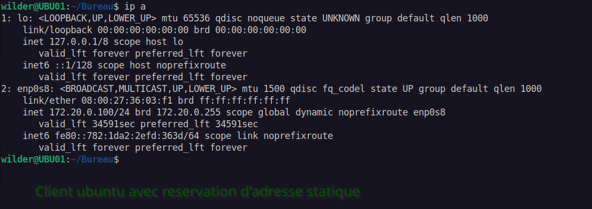
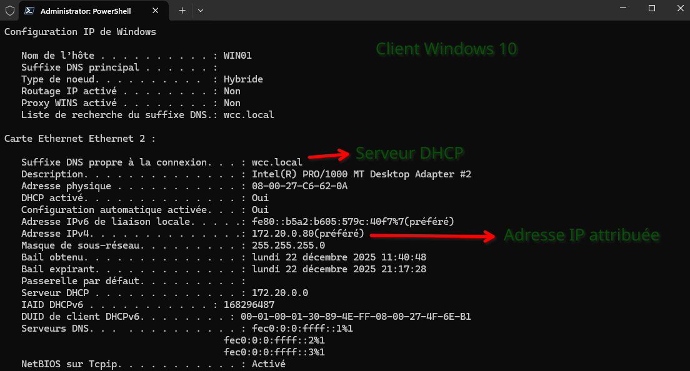

# DHCP-avec-Linux-Debian

### La configuration DHCP avec l'affichage de la fenêtre de reservation sur le serveur

  

### La configuration IP du 1er client

### La configuration IP du second client

