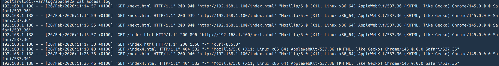
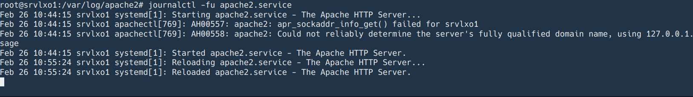

# Les Logs

### Affichage de /var/log/apache2/access.log

* Les requêtes réussies (code 200)  

Connexion au serveur web resussie depuis l'adresse IP 192.168.1.138 le 26 février sur la page "index.html"

* Les erreurs 404 (page non trouvée)  

Tentative de connexion à la page "index4.tml" qui est inexistante
  
* Les adresses IP les plus fréquentes

192.168.1.138

### journalctl -fu apache2.service  

-f pour afficher les logs en temps réel  
-u pour le service

-> Pas d'erreurs sur le serveur
