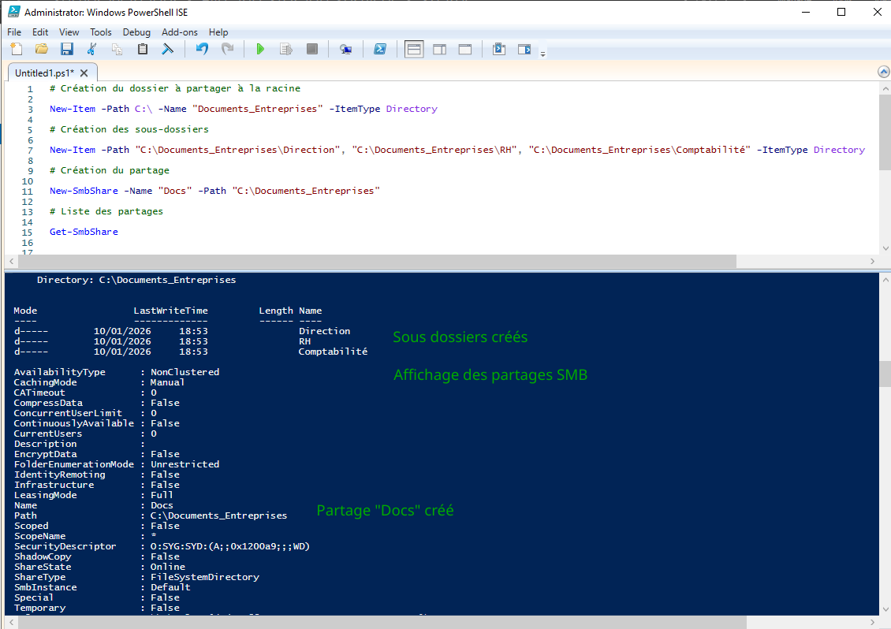
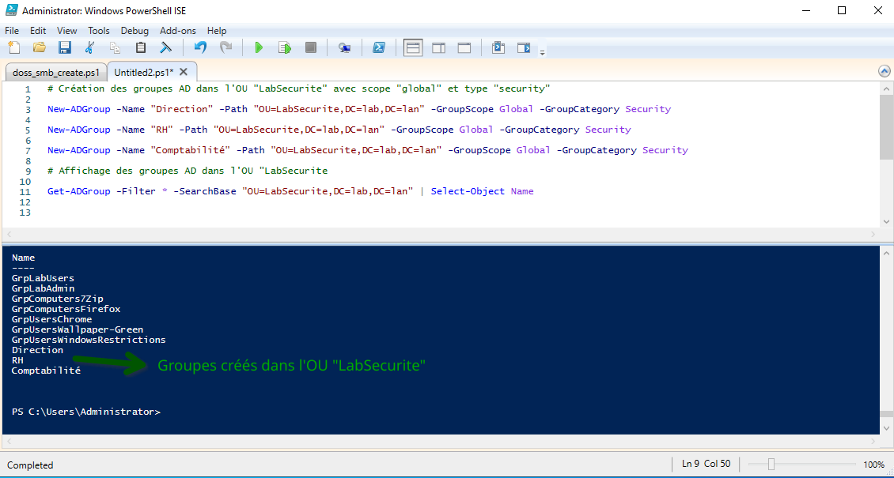
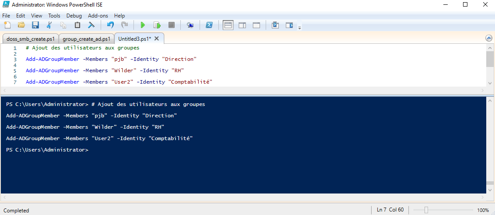
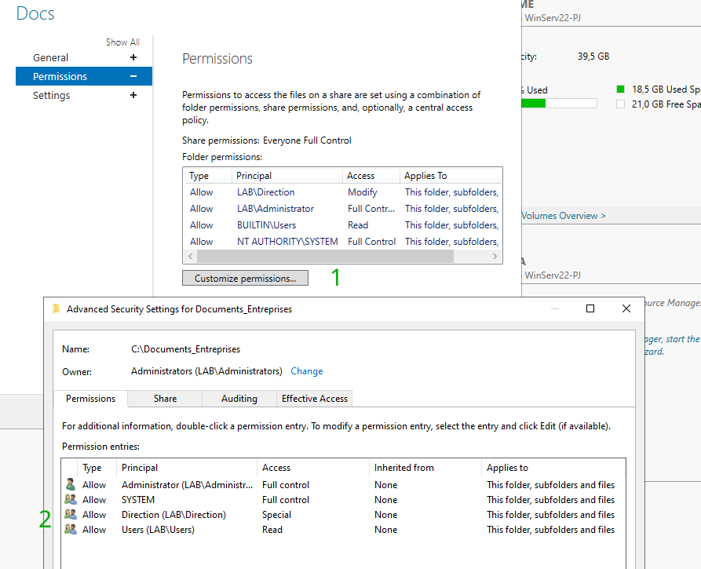
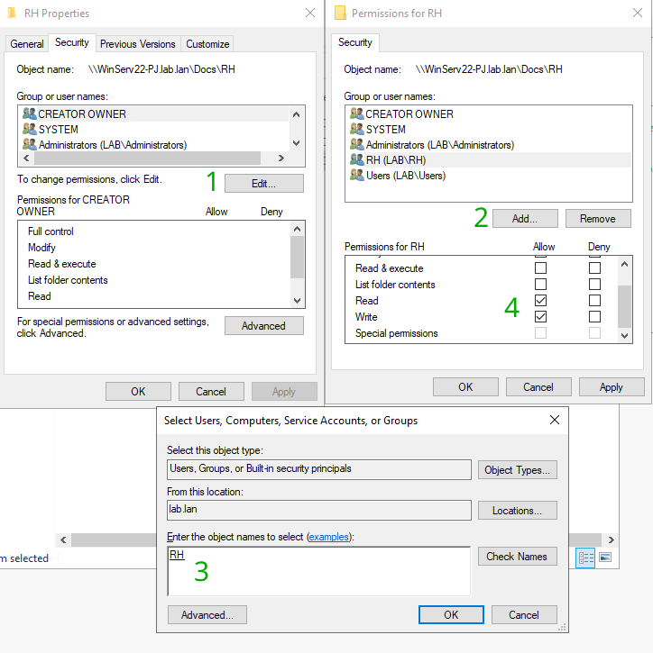
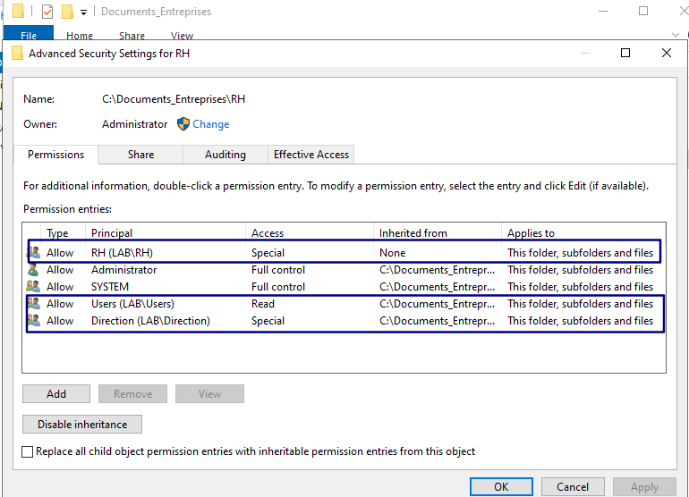
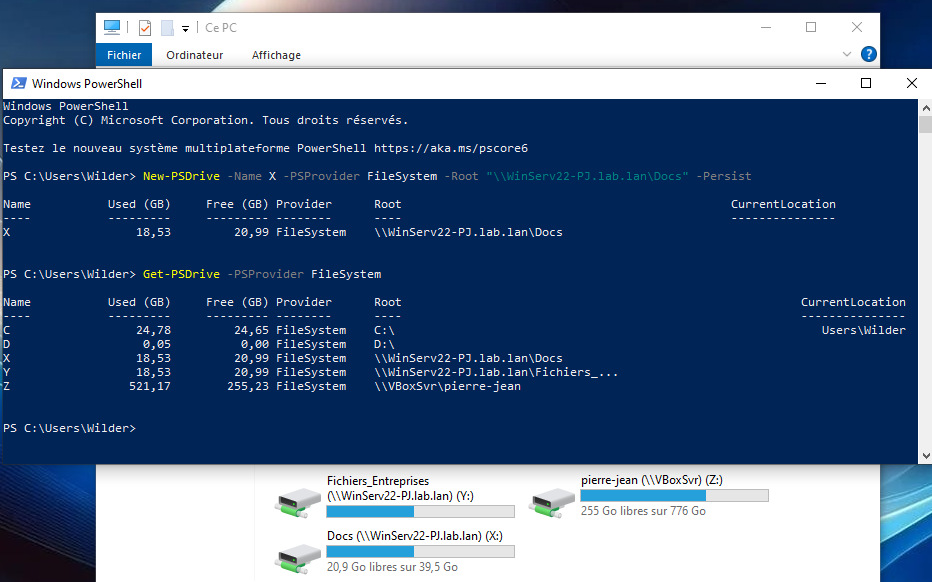
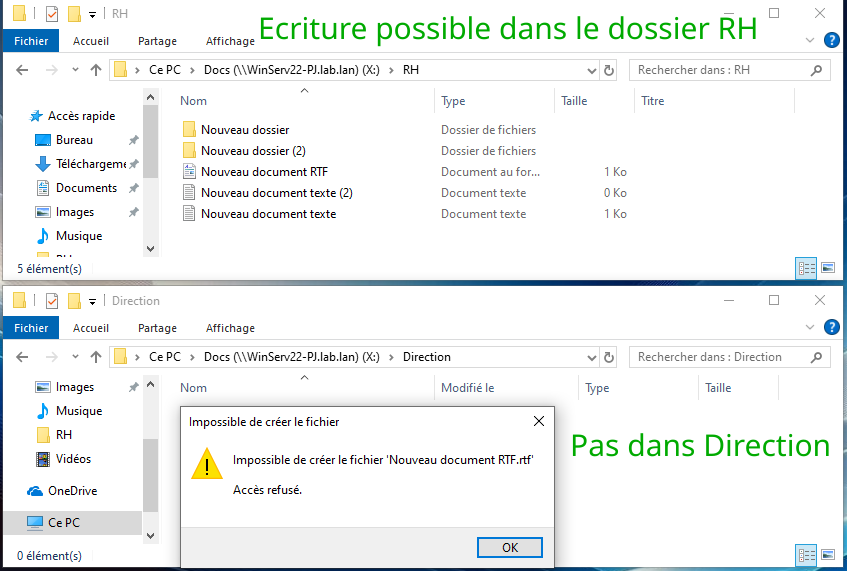
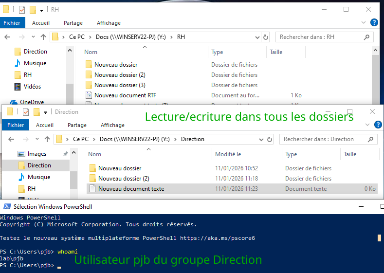

# Partage de fichiers (Windows)

### Creation de dossiers et partage SMB sur Windows Server

* Création du dossier et sous dossiers à partager
* Création du partage SMB
* Affichage de la liste des partages

### Creation des groupes AD

* Création de chaque groupes AD avec la commande `New-ADGroup`
* Affichage des groupes créés avec la commande `Get-ADGroup`

### Ajout d'utilisateurs dans les groupes

### Configuration des permissions en graphique

#### 1) Configuration du dossier principal

* Se rendre dans la configuation du partage puis permissions
* Désactiver l'heritage pour ce dossier (il sera activé sur les sous-dossiers)
* Ajouter le groupe Direction qui aura accès au dossier et sous dossiers en lecture/ecriture
* Ajouter le groupe Users qui aura accès au dossier et sous dossiers en lecture seule

#### 2) Configuration des sous dossiers RH et comptabilité

* Pour le sous-dossier RH, ajout du groupe RH
* Droits en lecture/ecriture sur le sous-dossier

* Affichage des permissions du sous-dossier RH avec l'heritage activé
  * Groupe RH créé
  * Groupes Users et Direction hérités

***Le même schéma sera appliqué au sous-dossier comptabilité avec le groupe comptabilité***

Ainsi, tous les utilisateurs ont droit en lecture et la direction à droit en lecture/ecriture

Les utilisateurs des groupes RH et comptabilité ont en plus du droit en lecture, le droit en écriture dans leurs sous-dossiers respectifs  

### Montage du partage sur la machine cliente

* Possible en graphique ou avec la commande :  
`New-PSDrive -Name "X,Y..." -PSProvider FileSystem -Root "\\NOMSERVEUR\Docs" -Persist`  
* Affichage des lecteurs montés avec la commande :  
`Get-PSDrive -PSProvider FileSystem`

### Tests des droits d'accès

#### 1) Utilisateur du groupe RH

#### 2) Utilisateur du groupe Direction  

